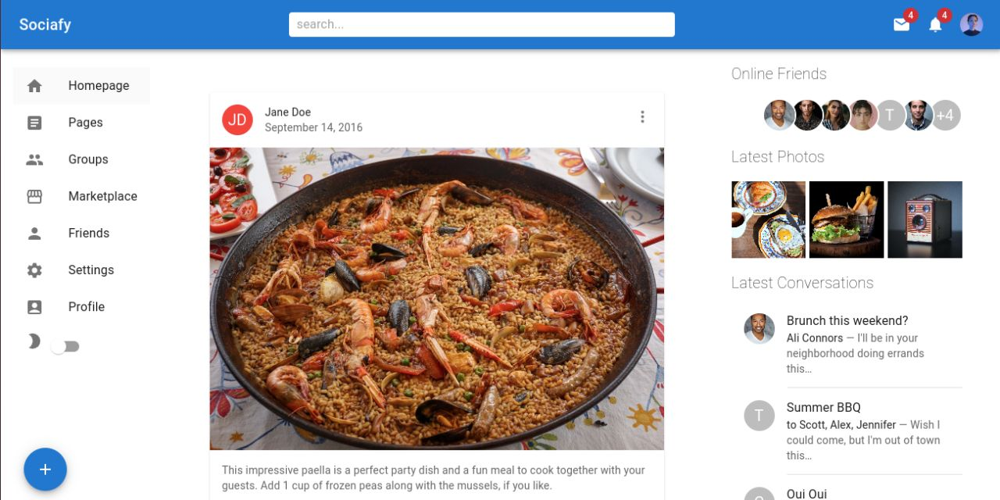

# Sociafy

**Note:** This is a test project aimed at experimenting with Material UI components in a React application. It is intended for learning purposes and should not be used in a production environment.

Sociafy is a fictional social media web application where users can post images and descriptions, connect with others, and follow their activities. It provides a platform for users to share their moments and interact with one another. Although it bears similarities to social media platforms like Facebook, this project is purely a frontend implementation and does not include backend functionality. User data is hardcoded for simplicity.



## Table of Contents
- [Prerequisites](#prerequisites)
- [Setup and Deployment](#setup-and-deployment)
- [Usage](#usage)
- [Contributing](#contributing)
- [Resources](#resources)
- [License](#license)
- [Support](#support)

## Prerequisites
Before you begin, make sure you have the following prerequisites:

- [Node.js](https://nodejs.org/) installed (version 14.x or later).
- [Vite](https://vitejs.dev/) installed globally. You can install it using npm or yarn:
  ```bash
  npm install -g create-vite
  ```
  or
  ```bash
  yarn global add create-vite
  ```

## Setup and Deployment
1. Clone this repository:
   ```bash
   git clone https://github.com/<your-username>/sociafy.git
   ```
2. Move into the project directory:
    ```bash
    cd sociafy
    ```
3. Install the required packages:
    ``` bash
    npm install 
    ```
4. Run the development server:
    ```bash
    npm run dev
    ```
5. Access the application in your web browser at http://localhost:3000.

## Usage
- Browse posts shared by users.
- Interact with posts by liking and commenting.
- Connect with other users and follow their activities.

## Contributing
Contributions are welcome! If you'd like to contribute to this project or have suggestions, please open an issue or submit a pull request. Please follow the [Code of Conduct](./CODE_OF_CONDUCT.md) when contributing.

To submit a pull request:

1. [Fork](https://docs.github.com/en/get-started/quickstart/fork-a-repo) the repository.
2. Create your feature branch: `git checkout -b feature/<your-feature-name>`
3. Commit your changes: `git commit -am '<Add some feature>'`
4. Push to the branch: `git push origin feature/<your-feature-name>`
5. Create a new Pull Request.

## Resources
- [React](https://reactjs.org/)
- [Vite](https://vitejs.dev/)
- [Material UI](https://mui.com/)

## License
This project is open-source and available under the [MIT License](./LICENSE.md).

## Support
If you have any questions or need assistance, feel free to open an issue in the repository or reach out to me via email at: hello@tanjaschmidt.com.